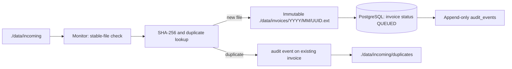

# AI Invoice Auditor

Phase 0/1 implementation of a containerized invoice auditing system. This milestone durably ingests invoice files; it intentionally does **not** implement extraction, translation, validation, human review, RAG, reporting, or a UI yet.

## Architecture



PostgreSQL is the workflow-state source of truth. `./data` is a host bind mount and holds original invoice artifacts. Database files use Docker's `postgres_data` named volume.

## State machine

Phase 1 uses `DISCOVERED → QUEUED`. Future transitions are centralized in `app/state_machine.py`: `QUEUED → EXTRACTING → TRANSLATING → VALIDATING → COMPLETED`, with `NEEDS_REVIEW`, `FAILED`, `INDEXING`, and `INDEXED` routes declared for subsequent phases. Invalid transitions raise an error.

## Run

```bash
cp .env.example .env
docker compose up --build
```

Drop a supported file (PDF, DOCX, PNG, JPG, TIFF, BMP) into `data/incoming/`. The monitor observes it unchanged for `FILE_STABILITY_SECONDS`, hashes it, stores an immutable UUID-named copy in `data/invoices/YYYY/MM/`, records audit history, and sets its database status to `QUEUED`.

Processed source files move to `data/incoming/processed/`; duplicate source files move to `data/incoming/duplicates/`. This prevents restart-driven re-ingestion without deleting intake evidence.

Check state:

```bash
docker compose exec postgres psql -U invoice_auditor -d invoice_auditor -c "SELECT id, original_filename, status, checksum_sha256 FROM invoices;"
docker compose exec postgres psql -U invoice_auditor -d invoice_auditor -c "SELECT invoice_id, event_type, occurred_at FROM audit_events ORDER BY id;"
```

## Tests

```bash
python -m pip install -r requirements-dev.txt
pytest
```

Unit tests cover checksums, stability behavior, supported filename handling, and state transitions. PostgreSQL repository, worker-claim, extraction, validation, review, and RAG integration tests arrive with their corresponding phases.

## Environment

Use `.env.example` as the starting point. Do not commit `.env`; credentials are supplied only through environment variables. `MAX_FILE_SIZE_BYTES` bounds a single incoming file.

## Deliberate Phase 1 boundary

The existing planning document previously described Phase 1 extraction and completion. It is superseded by this milestone's explicit boundary: a successful ingestion finishes at `QUEUED`. Phase 2 will add transactional queue claiming and retry recovery; Phase 3 begins extraction.
