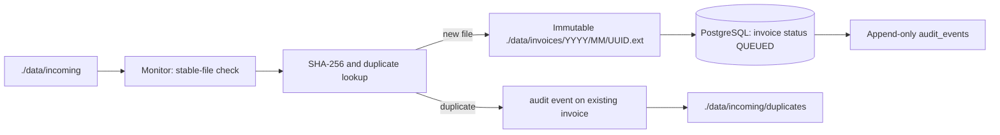

# AI Invoice Auditor

Phase 0–3 implementation of a containerized invoice auditing system. It durably ingests invoice files, safely claims PostgreSQL-backed jobs, and extracts structured invoice data locally from digital PDFs, scanned PDFs, DOCX files, and supported images. Translation, validation, human review, RAG, reporting, and the UI remain later phases.

## Clean architecture

The ingestion path is split into dependency-inverted layers:

```text
monitor (interface adapter)
    → application/ingest_invoice.py (use case)
        → application/ports.py (repository and file-store contracts)
            ← infrastructure/postgres.py + infrastructure/files.py
        → domain/file_policy.py + domain/models.py (pure rules and values)
```

The application use case owns the workflow, the domain owns file policies and value objects, and infrastructure owns PostgreSQL/filesystem details. `app/ingestion.py` remains a compatibility facade for existing callers while new code should compose the use case and adapters directly.

## Architecture



PostgreSQL is the workflow-state source of truth. `./data` is a host bind mount and holds original invoice artifacts. Database files use Docker's `postgres_data` named volume. PostgreSQL is exposed only on localhost port `54329` by default to support local integration tests; workers use the Compose service name internally.

## State machine

Phase 1 uses `DISCOVERED → QUEUED`. Future transitions are centralized in `app/state_machine.py`: `QUEUED → EXTRACTING → TRANSLATING → VALIDATING → COMPLETED`, with `NEEDS_REVIEW`, `FAILED`, `INDEXING`, and `INDEXED` routes declared for subsequent phases. Invalid transitions raise an error.

## Run

```bash
cp .env.example .env
docker compose up --build
```

Drop a supported file (PDF, DOCX, PNG, JPG, TIFF, BMP) into `data/incoming/`. The monitor observes it unchanged for `FILE_STABILITY_SECONDS`, hashes it, stores an immutable UUID-named copy in `data/invoices/YYYY/MM/`, records audit history, and sets its database status to `QUEUED`.

Processed source files move to `data/incoming/processed/`; duplicate source files move to `data/incoming/duplicates/`. This prevents restart-driven re-ingestion without deleting intake evidence.

Check state:

```bash
docker compose exec postgres psql -U invoice_auditor -d invoice_auditor -c "SELECT id, original_filename, status, checksum_sha256 FROM invoices;"
docker compose exec postgres psql -U invoice_auditor -d invoice_auditor -c "SELECT invoice_id, event_type, occurred_at FROM audit_events ORDER BY id;"
```

## Tests

```bash
python -m pip install -r requirements-dev.txt
pytest
```

Unit tests cover ingestion rules, state transitions, document dispatch, PDF/DOCX extraction, OCR fallback, deterministic normalization, provenance, and `Decimal` handling. PostgreSQL integration tests cover concurrent claims, retries/recovery, and atomic extraction persistence; the OCR integration test invokes the real local Tesseract runtime.

## Environment

Use `.env.example` as the starting point. Do not commit `.env`; credentials are supplied only through environment variables. `MAX_FILE_SIZE_BYTES` bounds a single incoming file.

## Deliberate Phase 1 boundary

The existing planning document previously described Phase 1 extraction and completion. It is superseded by this milestone's explicit boundary: a successful ingestion finishes at `QUEUED`. Phase 2 adds transactional queue claiming and retry recovery; Phase 3 begins extraction.

## Phase 2 worker behavior

Workers claim one `QUEUED` row in a short transaction using PostgreSQL `FOR UPDATE SKIP LOCKED`, set `EXTRACTING`, record `worker_id`/`claimed_at`, and commit before calling the processor. The processor runs outside the transaction; completion or failure is persisted in a second transaction guarded by the worker ownership columns. `retry_count` means completed failed attempts, and `MAX_PROCESSING_ATTEMPTS` bounds retries (the default is three). A stale processing lease older than `STALE_JOB_TIMEOUT_SECONDS` is returned to `QUEUED` and increments the retry count, or becomes `FAILED` when the bound is exhausted. `JOB_CLAIMED`, `PROCESSING_FAILED`, retry, stale-recovery, and state-transition events are append-only audit records.

Scale workers with `docker compose up --scale worker=2`.

## Phase 3 extraction

Document-specific extractors first produce a page-aware `RawDocument`. A separate deterministic field extractor converts it into a Pydantic `NormalizedInvoice` with `Decimal` monetary values, dates, line items, and field evidence. Digital PDFs use embedded text when the configured meaningful-character and printable-ratio thresholds are met; scanned PDFs and images use local Tesseract OCR. DOCX extraction preserves both paragraphs and table rows.

Current raw and structured extraction rows are replaced atomically on a retry, while append-only audit events preserve attempt history. Successful extraction commits raw pages, normalized fields, line items, evidence, audit events, and `EXTRACTING → TRANSLATING` in one transaction. Translation is not implemented.

Generate the non-confidential demonstration documents and start the stack:

```bash
python -m tests.fixtures.generate_examples
docker compose up --build --scale worker=2
```

OCR configuration is local and static: `OCR_LANGUAGES=eng`, `OCR_DPI=200`, and `EXTRACTION_MAX_PAGES=25` by default. Install additional Tesseract language packs in the image before adding codes such as `deu` or `fra`; workers never download models at runtime.
